# HomeLab Infrastructure as Code (IAC)

This repository contains the infrastructure as code (IAC) for managing a homelab environment using Ansible, Terraform, and Docker. The setup includes various services such as DNS, Docker containers, and LXC containers managed through Proxmox.

## Overview

The HomeLab IAC repository is structured to provide a seamless and automated way to manage a homelab environment. The key components include:

- **Ansible**: Used for configuration management and application deployment.
- **Terraform**: Manages the infrastructure provisioning and lifecycle.
- **Docker**: Runs containerized applications and services.
- **Proxmox**: Hosts and manages virtual machines and LXC containers.

By leveraging these tools, the repository aims to simplify the deployment and management of various services, ensuring a consistent and reproducible environment.

## Architecture

```mermaid
graph TB
    subgraph PVE["Proxmox VE Host (192.168.200.100)"]
        subgraph row1[" "]
            pihole["🛡️ Pi-hole<br/>LXC 100<br/>10.20.1.1"]
            bind9["🌐 bind9<br/>LXC 201<br/>10.20.1.201"]
            nginx["🔀 nginx<br/>LXC 110<br/>10.20.1.10"]
            ntfy["🔔 ntfy<br/>LXC 202<br/>10.20.1.202"]
        end
        subgraph row2[" "]
            fileserver["📁 fileserver<br/>LXC 203<br/>10.20.1.203"]
            jellyfin["🎬 jellyfin<br/>LXC 204<br/>10.20.1.204"]
            dockerhost["🐳 dockerhost<br/>LXC 205<br/>10.20.1.205"]
            homeassistant["🏠 homeassistant<br/>LXC 206<br/>10.20.1.206"]
        end
        subgraph row3[" "]
            localai["🤖 localai<br/>LXC 207<br/>10.20.1.207"]
            cloudflared["☁️ cloudflared<br/>LXC 208<br/>10.20.1.208"]
            signumminer["⛏️ signumminer<br/>LXC 209<br/>10.20.1.209"]
            prometheus["📊 prometheus<br/>LXC 210<br/>10.20.1.210"]
        end
        subgraph row4[" "]
            n8n["⚡ n8n<br/>LXC 211<br/>10.20.1.211"]
            ghrunner["🏃 GH Runner<br/>LXC 5xx"]
        end
    end

    style PVE fill:#1a1a2e,stroke:#16213e,color:#fff
    style row1 fill:#0f3460,stroke:#16213e
    style row2 fill:#0f3460,stroke:#16213e
    style row3 fill:#0f3460,stroke:#16213e
    style row4 fill:#0f3460,stroke:#16213e
```



## Prerequisites

- **Proxmox VE** installed and configured
- **Network**: Internal network `10.20.0.0/16` configured
- **Domain**: `matagoth.com` (or your own domain)
- **Storage**: ZFS pool (`zpool`) for persistent data
- **Secrets**: Required credentials stored in `/pve/secrets/`

### Required Secrets

The following environment variables/secrets are required:

| Variable | Description |
|----------|-------------|
| `PM_API_URL` | Proxmox API URL |
| `PM_API_TOKEN_ID` | Proxmox API token ID |
| `PM_API_TOKEN_SECRET` | Proxmox API token secret |
| `PM_PASS` | Proxmox root password (for LXC containers) |
| `DNS_TSIG_KEY` | TSIG key for DNS updates |
| `CLOUDFLARE_TUNNEL_TOKEN` | Cloudflare tunnel token |
| `NTFY_CREDS` | ntfy authentication credentials |

## Quick Start

### 1. Clone the Repository

```bash
git clone https://github.com/wiktordepina/homelab.git
cd homelab
```

### 2. Build the Runner Toolbox

```bash
cd runner-toolbox
docker build -t runner-toolbox .
```

### 3. Provision a New LXC Container

```bash
# Create LXC config in config/lxc/<vmid>.yaml
# Then run:
./run/execute_runner terraform_lxc <vmid> apply
```

### 4. Configure the LXC Container

```bash
./run/execute_runner ansible_lxc <vmid>
```

## Project Structure

```
homelab/
├── ansible/                    # Ansible configuration management
│   └── roles/                  # Reusable Ansible roles
├── config/                     # Configuration files
│   ├── docker/                 # Docker Compose stacks
│   ├── lxc/                    # LXC container definitions
│   └── pve/                    # Proxmox VE playbooks
├── docs/                       # Additional documentation
├── run/                        # Local execution scripts
├── runner-toolbox/             # CI/CD Docker container
│   ├── functions/              # Bash helper functions
│   └── scripts/                # Executable scripts
└── terraform/                  # Infrastructure provisioning
    ├── dns/                    # DNS record management
    └── lxc/                    # LXC container provisioning
```

## Services

| LXC ID | Hostname | IP Address | Purpose |
|--------|----------|------------|---------|
| 100 | pihole | 10.20.1.1 | DNS sinkhole and ad blocker |
| 110 | nginx | 10.20.1.10 | Reverse proxy with SSL termination |
| 201 | bind9 | 10.20.1.201 | Authoritative DNS server |
| 202 | ntfy | 10.20.1.202 | Push notification service |
| 203 | fileserver | 10.20.1.203 | File server with Cockpit UI |
| 204 | jellyfin | 10.20.1.204 | Media server (GPU accelerated) |
| 205 | dockerhost | 10.20.1.205 | Docker container host |
| 206 | homeassistant | 10.20.1.206 | Home automation |
| 207 | localai | 10.20.1.207 | Local AI/LLM services |
| 208 | cloudflared | 10.20.1.208 | Cloudflare tunnel |
| 209 | signumminer | 10.20.1.209 | Signum cryptocurrency miner |
| 210 | prometheus | 10.20.1.210 | Monitoring and alerting |
| 211 | n8n | 10.20.1.211 | Workflow automation |
| 5xx | - | - | GitHub Actions runners |

## Documentation

- [LXC Configuration Guide](docs/LXC_CONFIGURATION.md) - How to define and manage LXC containers
- [Runner Toolbox](docs/RUNNER_TOOLBOX.md) - CI/CD automation tooling
- [Workflows](docs/WORKFLOWS.md) - Common operational workflows
- [Network Architecture](docs/NETWORK.md) - IP addressing and network design
- [Docker Stacks](docs/DOCKER_STACKS.md) - Docker Compose service configurations

### Operational Guides

- [Create GitHub Actions Runner](docs/CREATE_GH_RUNNER.md)
- [Create Wildcard SSL Certificate](docs/CREATE_WILDCARD_SSL_CERT.md)
- [Replace Disk in ZFS Pool](docs/REPLACE_DISK_IN_ZFS_POOL.md)

## Ansible Roles

| Role | Description |
|------|-------------|
| `base` | Base system configuration and updates |
| `certbot` | SSL certificate management with Let's Encrypt |
| `cloudflared` | Cloudflare tunnel client |
| `cockpit` | Web-based server management UI |
| `containers` | Docker container deployment |
| `dns` | BIND9 DNS server configuration |
| `docker` | Docker engine installation |
| `gpu_drivers` | NVIDIA GPU driver installation |
| `graphana` | Grafana dashboard |
| `graphite_exporter` | Graphite metrics exporter |
| `homeassistant` | Home Assistant setup |
| `jellyfin` | Jellyfin media server |
| `localai` | LocalAI LLM server |
| `nginx_reverse_proxy` | Nginx reverse proxy |
| `node_exporter` | Prometheus node exporter |
| `ntfy` | ntfy notification server |
| `nvidia_container_toolkit` | NVIDIA container runtime |
| `pihole` | Pi-hole DNS sinkhole |
| `prometheus` | Prometheus monitoring |
| `signum_miner` | Signum cryptocurrency miner |
| `telegraf` | Telegraf metrics agent |

## CI/CD

This repository uses GitHub Actions for continuous deployment. The workflow:

1. **Trigger**: Push to main branch or manual dispatch
2. **Runner**: Self-hosted runner in LXC container (ID 500-599)
3. **Toolbox**: Docker container with Terraform, Ansible, and dependencies
4. **Execution**: Terraform provisions infrastructure, Ansible configures services

See [Runner Toolbox](docs/RUNNER_TOOLBOX.md) for details.
