# Network Architecture

> **Navigation:** [← Back to README](../README.md)

This document describes the network architecture and IP addressing scheme for the homelab.

## Network Overview

```mermaid
flowchart TB
    subgraph Internet
        inet["🌐 Internet"]
    end

    subgraph Cloudflare
        cf["Cloudflare Tunnel<br/>(cloudflared LXC 208)"]
    end

    subgraph homelab["Homelab Network (10.20.0.0/16)"]
        subgraph infra["Infrastructure"]
            pihole["Pi-hole<br/>10.20.1.1<br/>DNS sink"]
            nginx["nginx reverse proxy<br/>10.20.1.10<br/>SSL termination"]
            bind9["bind9<br/>10.20.1.201<br/>Internal DNS"]
        end

        subgraph services["Services"]
            svc1["Services<br/>10.20.1.202-211"]
            svc2["Docker hosts"]
            svc3["Monitoring"]
        end

        subgraph pve["Proxmox VE Host (192.168.200.100)"]
            zfs["ZFS Pool<br/>~50TB"]
            telegraf["Telegraf<br/>Metrics"]
            gpu["NVIDIA GPU<br/>Passthrough"]
            storage["Storage<br/>Mounts"]
        end
    end

    inet --> cf
    cf --> nginx
    nginx <--> pihole
    nginx <--> bind9
    nginx --> svc1
    nginx --> svc2
    nginx --> svc3
```



## IP Address Allocation

### Network Ranges

| Range | CIDR | Purpose |
|-------|------|---------|
| 10.20.0.0/16 | 10.20.0.0 - 10.20.255.255 | Homelab internal network |
| 192.168.200.0/24 | 192.168.200.0 - 192.168.200.255 | Management network |

### Static Allocations

#### Infrastructure (10.20.0.x - 10.20.1.99)

| IP Address | Hostname | Purpose |
|------------|----------|---------|
| 10.20.0.1 | gateway | Network gateway |
| 10.20.1.1 | pihole | DNS sinkhole (primary DNS) |
| 10.20.1.10 | nginx | Reverse proxy, SSL termination |

#### Services (10.20.1.200 - 10.20.1.254)

| IP Address | LXC ID | Hostname | Purpose |
|------------|--------|----------|---------|
| 10.20.1.201 | 201 | bind9 | Authoritative DNS |
| 10.20.1.202 | 202 | ntfy | Push notifications |
| 10.20.1.203 | 203 | fileserver | File server (Cockpit) |
| 10.20.1.204 | 204 | jellyfin | Media server |
| 10.20.1.205 | 205 | dockerhost | Multi-container host |
| 10.20.1.206 | 206 | homeassistant | Home automation |
| 10.20.1.207 | 207 | localai | Local LLM services |
| 10.20.1.208 | 208 | cloudflared | Cloudflare tunnel |
| 10.20.1.209 | 209 | signumminer | Signum miner |
| 10.20.1.210 | 210 | prometheus | Monitoring |
| 10.20.1.211 | 211 | n8n | Workflow automation |

#### Management (192.168.200.x)

| IP Address | Hostname | Purpose |
|------------|----------|---------|
| 192.168.200.100 | pve | Proxmox VE host |

## VMID Allocation Scheme

| Range | Purpose | Example |
|-------|---------|---------|
| 100-199 | Infrastructure LXC | 100 (pihole), 110 (nginx) |
| 200-499 | Application LXC | 201-211 (services) |
| 500-599 | GitHub Actions runners | 500, 501, etc. |

## DNS Architecture


### DNS Zones

| Zone | Type | Purpose |
|------|------|---------|
| home.matagoth.com | Internal | Internal service resolution |
| homelab.matagoth.com | External | External access via Cloudflare |

### DNS Record Management

Internal DNS records are managed via Terraform:

```bash
./run/execute_runner terraform_dns apply
```

Records are defined in `terraform/dns/`:
- `infra.tf` - Infrastructure records
- `services.tf` - Application services
- `reverse_proxy.tf` - External-facing services

## Traffic Flow

### Internal Access

```
Client → Pi-hole (DNS) → bind9 → Service IP
```

### External Access (via Cloudflare Tunnel)

```
Internet → Cloudflare Edge → cloudflared (LXC 208) → nginx → Service
```

### Reverse Proxy Routes

All external traffic flows through nginx (LXC 110):

| Subdomain | Backend |
|-----------|---------|
| jellyfin.homelab.matagoth.com | 10.20.1.204:8096 |
| n8n.homelab.matagoth.com | 10.20.1.211:5678 |
| prometheus.homelab.matagoth.com | 10.20.1.210:9090 |
| ... | ... |

## Firewall Rules

### Container Isolation

- Containers use Proxmox bridge networking
- Inter-container traffic allowed on same bridge
- External traffic must go through nginx reverse proxy

### Key Ports

| Port | Service | Location |
|------|---------|----------|
| 22 | SSH | All containers |
| 53 | DNS | Pi-hole, bind9 |
| 80/443 | HTTP/HTTPS | nginx |
| 8006 | Proxmox UI | PVE host |

## VPN Configuration

The arrs stack uses WireGuard VPN via Gluetun:

```mermaid
flowchart TB
    subgraph dockerhost["dockerhost (LXC 205)"]
        subgraph gluetun["Gluetun (WireGuard VPN client)"]
            sonarr["Sonarr"]
            radarr["Radarr"]
            qbit["qBittorrent"]
        end
    end

    vpn["VPN Provider<br/>(WireGuard)"]
    internet["🌐 Internet"]

    gluetun --> vpn
    vpn --> internet
```



## Monitoring Network


## Adding New Network Resources

### New LXC Container

1. Choose IP from available range (10.20.1.212+)
2. Update LXC config with IP
3. Add DNS record in Terraform
4. Add reverse proxy entry if external access needed

### New Subnet

1. Configure on Proxmox bridge
2. Update firewall rules
3. Document in this file

## Troubleshooting

### Check Container Network

```bash
pct exec <vmid> -- ip addr
pct exec <vmid> -- ping 10.20.0.1
```

### DNS Resolution Test

```bash
dig @10.20.1.201 myservice.home.matagoth.com
nslookup myservice.home.matagoth.com 10.20.1.1
```

### Check Route to Container

```bash
ping 10.20.1.<id>
traceroute 10.20.1.<id>
```
